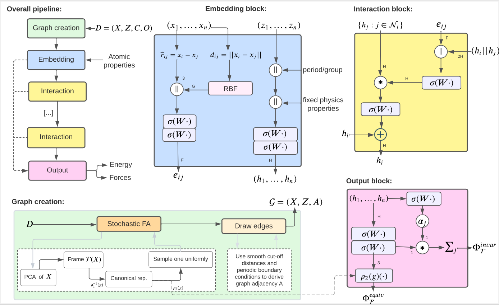

Getting started
===============

This section describes how to (1) use the Frame Averaging transform (2) use FAENet to make predictions on your own dataset (3) evaluate model properties and test the code.

.. contents:: Table of Contents
    :depth: 1
    :local:

Frame Averaging
---------------

:class:`~faenet.transforms.FrameAveraging` is a Transform method applicable to (pytorch-geometric) ``Data`` object. It should be called in the ``get_item()`` function of your ``Dataset`` class. This method derives a new canonical position for the 3D atomic graph, identical for all euclidean symmetries, and stores it under the data attribute ``fa_pos``.

You can choose among several options for the frame averaging, ranging from *Full FA* to *Stochastic FA* (in 2D or 3D) including traditional data augmentation *DA* with rotated samples. This transform can be applied to most datasets and data format: it only necessitates a ``data.pos`` attribute, and optionally ``data.cell`` for periodic boundary conditions.

.. code-block:: python

    import torch
    from faenet.transforms import FrameAveraging

    frame_averaging = "3D"  # symmetry preservation method used: {"3D", "2D", "DA", ""}:
    fa_method = "stochastic"  # the frame averaging method: {"det", "all", "se3-stochastic", "se3-det", "se3-all", ""}:
    transform = FrameAveraging(frame_averaging, fa_method)
    transform(data)  # transform the data object

Model Forward Pass with Frame Averaging
---------------------------------------

:meth:`~faenet.fa_forward.model_forward` aggregates the predictions of a chosen ML model (e.g FAENet) when Frame Averaging is applied, as stipulated by the Equation (1) of the `paper <https://arxiv.org/pdf/2305.05577.pdf>`_. Indeed, applying the model on canonical positions (``batch.fa_pos``) directly would not yield equivariant predictions. This method must be applied at training and inference time to compute all model predictions. Note that ``batch`` is a batch of data objects, with ``batch.pos``, ``batch.batch`` and ``batch.fa_pos`` attributes.

The output of this method is a dictionary with the following keys:
    * ``energy``: for graph-level predictions (e.g. energy). We can predict multiple properties at the same time with ``out_dim``.
    * ``forces``: for atom-level predictions (e.g. forces).
    * ``hidden_state``: final atom-level representations.

.. code-block:: python

    from faenet.fa_forward import model_forward

    preds = model_forward(
        batch=batch,   # batch from, dataloader
        model=model,  # FAENet(**kwargs)
        frame_averaging="3D", # ["2D", "3D", "DA", ""]
        mode="train",  # for training
        crystal_task=True,  # for crystals, with pbc conditions
    )

FAENet
------

Implementation of the :class:`~faenet.model.FAENet` GNN model, compatible with any dataset or transform. In a word, FAENet is a very simple, scalable and expressive model. Since does not explicitly preserve data symmetries, it has the ability to process directly and unrestrictedly atom relative positions, which is very efficient and powerful. Although it was specifically designed to be applied with Frame Averaging above, to preserve symmetries without any design restrictions, it can also be applied without.

**Notes**:
    * When applied with Frame Averaging, you need to use the :meth:`~faenet.fa_forward.model_forward` function above to compute model predictions, ``model(data)`` is not enough.
    * The ``forward()`` method is defined in :class:`~faenet.base_model.BaseModel`.
    * The training procedure is not given here, you should refer to the `original github repository <https://github.com/RolnickLab/ocp>`_.

**Assumption**: the input data (e.g. ``batch`` below) has certain attributes (e.g. atomic_numbers, batch, pos or edge_index). If your data does not have these attributes, you can apply custom pre-processing functions, taking :meth:`~faenet.utils.pbc_preprocess` or :meth:`~faenet.utils.base_preprocess` as inspiration. You simply need to pass them as argument to FAENet (``preprocess``).

.. code-block:: python

    from faenet.model import FAENet

    model = FAENet(**kwargs) # check the docstring for all arguments
    preds = model(batch)  # forward pass

Evaluation
----------

:meth:`~faenet.eval.eval_model_symmetries` helps you evaluate the equivariant, invariant and other properties of a model, as detailed in the paper.

Tests
-----

The ``/tests`` folder contains several useful unit-tests. Feel free to have a look at them to explore how the model can be used. For more advanced examples, please refer to the full `repository <https://github.com/RolnickLab/ocp>`_ used in our ICML paper to make predictions on OC20 IS2RE, S2EF, QM9 and QM7-X dataset.

.. code-block:: bash

    git clone git@github.com:vict0rsch/faenet.git
    poetry install --with dev
    pytest --cov=faenet --cov-report term-missing

Testing on Macs you may encounter a `Library Not Loaded Error <https://github.com/pyg-team/pytorch_geometric/issues/6530>`_